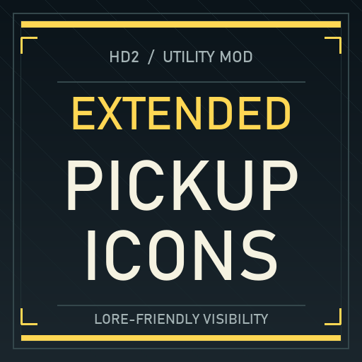

# Extended Pickup Icons Range



Lore-friendly pickup visibility for **HELLDIVERS 2** (tested on Steam build 25480438). Extends the game's native floating icons without adding light pillars or glowing textures. Requires **Bingus Shared Loader v15+** and Arsenal.

**[Download v3.0](https://github.com/NeverB0re/HD2-Extended-Pickup-Icons/releases/tag/v3.0)** · [한국어 설치 및 상세 설명](outputs/README_v30_KO.md)

Settings are in game: the **MODS** tab of the **Escape menu**, then **EXTENDED PICKUP ICONS**. This needs Mod Options Menu; without it the defaults apply.

| In-game setting | Targets | Default (recommended) | Range |
| --- | --- | ---: | ---: |
| Samples (on/off + distance) | Common, rare, super, packaged and intel samples | 35 | 35 to 100 |
| Supplies (on/off + distance) | Ammo, stims, grenade boxes and resupply pod packs | 20 | 20 to 100 |
| Equipment & mission items (on/off + distance) | Support/secondary/melee weapons, backpacks, dropped sample carriers and most mission carryables | 35 | 35 to 100 |
| Carried ammo & warhead distance (uses the Equipment switch) | SEAF shells, carry-ammo and warheads | 15 | 15 to 100 |

Changes take effect from the next mission. Turning a group off restores the game's own values. **Very high distances can fill the screen with icons and spoil the game; the mod's defaults are recommended.** The menu follows the game's Text Language in 12 languages.

Ordinary fuel barrels and Illuminate canisters retain their vanilla settings. Primary firearms and five ambiguous weapon records are excluded; Stalwart remains included as a support weapon. The Supplies switch also enables the existing stim ping icon.

These numbers are **internal settings, not guaranteed measured meters**: fading, item position and the game's display rules affect when an icon becomes visible. Pickup Radius and InteractType are unchanged.

## Install

1. Completely close the game and disable earlier Extended Pickup Icons Range versions.
2. Enable a compatible Bingus Shared Loader v15+ and, for in-game settings, Mod Options Menu.
3. Import the release ZIP into Arsenal. It has no Arsenal options.
4. Purge, Deploy and restart the game.

The ZIP is the Arsenal mod; GitHub's automatic source-code ZIP is not an installable mod.

## Compatibility and validation

Since v2.5 the mod no longer locks itself to one exact game build. It finds the game's item data by its header and each item by its resource ID. Before writing, it checks the item's zone name, Radius, interaction type, original ViewDistance and memory protection. Any item that does not match, for example because another mod or a game update changed it, is skipped and named in the log. Every other item still applies. It finds all targets once at startup and rewrites only the fields whose setting changed.

v2.5 applied all 251 zones in game on build 25480438. v3.0's in-game settings were checked in game; changed distances show from the next mission. Synthetic protected-memory tests (`work/test_extended_pickup_icons_v30.py`, needs `pip install lupa`) cover relocated and reordered data, menu switches and sliders, saved settings, a mismatched item, missing stim data, duplicate tables, late loading and the menu texts in 12 languages. v2.4 fixed six SEAF shell variants that remained at 35 in v2.3. **The SEAF shells' visible distance still requires in-game verification.** No benchmark claim is made.

Log: `%LOCALAPPDATA%\CowboyBingus\Helldivers2\Logs\CodexPickupIconRangeTest.log`.
A healthy start logs `matched samples=30 supplies=8 equipment=203 carry=10 ... skipped 0 unmatched` (251 zones).

## Source and build

`work/extended_pickup_icons_v30.lua` is the v3.0 script. Earlier core scripts, option scripts and build scripts are kept for reference. `work/release_v24_verified_targets.json` records the selected resources and expected values. Game binaries, extracted game databases, personal logs and the loader itself are not distributed here.

The original build script is preserved. It requires Python 3 and the Bingus Shared Loader authoring helpers `archive.py` and `build_addon.py` in `work/vendor/BingusSharedLoader-main/scripts/`. Obtain compatible helpers from the loader's authoring source. This repository neither forks nor bundles Shared Loader. Run:

```console
python work/build_extended_pickup_icons_v24.py
python verify_release.py
```

v2.5 and v3.0 need no extra helpers. v3.0 writes its one-file patch itself:

```console
python work/build_extended_pickup_icons_v30.py
python verify_release.py
```

Building changes no Lua behavior. The verifier checks the archived SHA-256, ZIP structure, target counts, and exact embedded source entries. It uses only Python's standard library. Different helper or compression implementations may require reviewing a changed checksum rather than assuming an identical release.

## Credits

CowboyBingus / Bingus Shared Loader for independent addon discovery and archive authoring tools; Filediver for the type/data parsing references used during investigation. This is an independent addon, not an official Arrowhead release. The dependency is installed separately.
